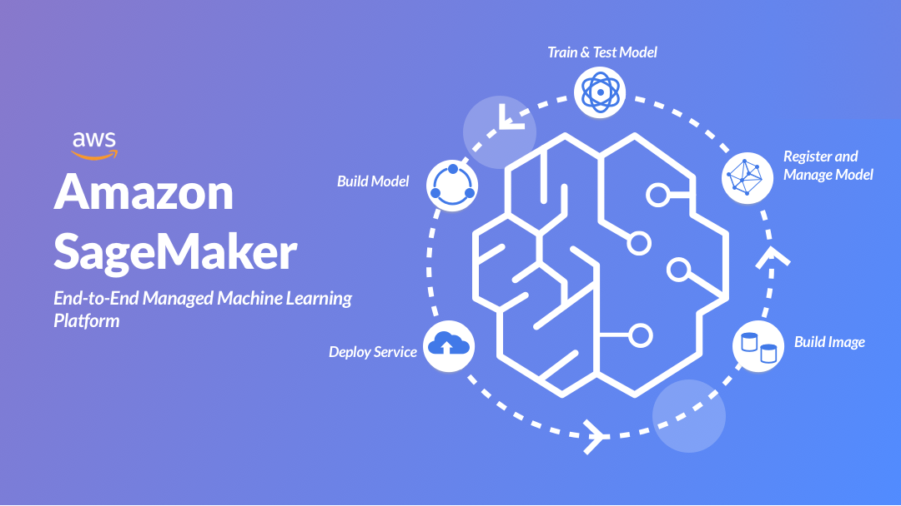

## Welcome to Sagemaker Immersion Labs

Amazon SageMaker Immersion Day help customers and partners to provide end to end understanding of building ML use cases from feature engineering to understanding various in-built algorithm and  Train , Tune and Deploy the ML model in production like scenario. It guides you to bring your own model and perform on-premise ML workload Lift-and-Shift to Amazon SageMaker platform. It further demonstrate advance concept like Model Debugging , Model Monitoring and AutoML  and guide to evaluate your machine leaning workload through  AWS ML Well-architect lens.

## Overview of the Labs

SageMakwer supports the following training methods:
* [Use Built-in Algorithms](xgboost_direct_marketing_sagemaker.ipynb)
* [Bring Your Own Container](bring-custom-container.ipynb)
* [Bring Your Own Scripts](bring-custom-script.ipynb)
* [Use AutoPilot](sagemaker_autopilot_direct_marketing.ipynb)

In addition, SageMaker also offers productivity enhancement features including:
* [Hyperparameter Optimization](hpo_xgboost_direct_marketing_sagemaker_python_sdk.ipynb)
* [Integrate with Feature Store](feature_store_xgboost_direct_marketing_sagemaker.ipynb)
* [Leverage Experiment](xgboost_experiments.ipynb)
* [Integrate with Debugger](xgboost_debugger_demo.ipynb)
* [Deploy Trained Model with Model Monitoring](SageMaker-ModelMonitoring.ipynb)
* [Work with Scikit Learn](sklearn-end2end.ipynb)
* [Data Pre-Processing](processing_xgboost.ipynb)

Find details on each lab here - https://sagemaker-immersionday.workshop.aws/ 

## License

This library is licensed under the MIT-0 License. See the LICENSE file.

